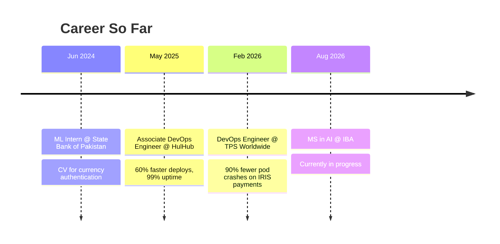

<div align="center">


<a href="https://git.io/typing-svg">
  
</a>

<p>
  
  
  
  
</p>

<p>
  <a href="https://www.linkedin.com/in/mahad-munir"></a>
  <a href="mailto:mahadmunir6@gmail.com"></a>
  <a href="https://mmahad3.github.io"></a>
</p>

</div>


<br/>

## `> whoami`


```bash
$ cat about_me.sh

#!/bin/bash
echo "AWS Certified DevOps Engineer @ TPS Worldwide"
echo "Currently: MS in AI @ IBA | BS CS @ FAST-NUCES"
echo "Location: Karachi, Pakistan"

while true; do
  fix_broken_infra
  automate_the_boring_stuff
  sleep 2AM && debug_production   # it's always 2AM somewhere
done
```

Led a **Helm configuration overhaul** at TPS Worldwide that made production Kubernetes deployments **90% more resistant to pod crashes**. Built **Python drift-detection tooling** that cut config audit time by up to **90%**. Previously cut deployment time **60%** across **10+ microservices** at HulHub Pakistan — sustaining **99% uptime** the whole time.

<br clear="right"/>


## 📊 Impact, in Numbers

<div align="center">

| 🔧 Helm Overhaul | 🐍 Drift Detection | ⚙️ Jenkins Automation | ☁️ Uptime Sustained |
|:---:|:---:|:---:|:---:|
| **90%** fewer pod crashes | **80–90%** faster audits | **60%** faster deploys | **99%** |
| hours → minutes fix time | Python-built, in prod | 10+ microservices | HulHub production |

</div>


## 🧠 Experience Timeline



<br/>

## ⚡ Tech Arsenal

<div align="center">

**☁️ Cloud & Platform**


**⚙️ CI/CD & Automation**


**💻 Systems & Web**


**🤖 AI / ML** <sub>— MS in AI @ IBA</sub>


</div>


## 🏆 Trophy Case

<div align="center">

</div>

<br/>

## 💻 Top Languages

<div align="center">

</div>

<br/>

## 🐍 Contribution Snake

<div align="center">


<sub>⚠️ Animates once you add the workflow file — see setup notes below.</sub>
</div>


## 🚀 Featured Builds

<table>
<tr>
<td width="50%" valign="top">

### 🔧 Helm Overhaul + Drift Detection


**Production system @ TPS Worldwide.** Replaced inconsistent Helm configs platform-wide, then built a Python tool that catches ConfigMap/YAML drift before it becomes an incident.

`Helm` `Kubernetes` `Python`
> 🎯 **90%** fewer crashes · **90%** faster audits

</td>
<td width="50%" valign="top">

### 🔵🟢 Zero-Downtime Blue-Green Deploy


Implemented blue-green deployment for a production ML web app — instant version switching, zero interruption, zero drama.

`Docker` `Nginx`
> 🎯 Zero downtime, every release

</td>
</tr>
<tr>
<td width="50%" valign="top">

### ☁️ MERN Stack → Live on AWS


Took a full MERN app from local codebase to production using EC2, S3, and RDS — the whole journey, not just the demo.

`AWS` `EC2` `S3` `RDS`
> 🎯 Local → production, end to end

</td>
<td width="50%" valign="top">

### 👁️ Real-Time CCTV Anomaly Detection


Final Year Project. Real-time anomaly detection pipeline using CNNs + Vision Transformers on live video streams.

`Python` `Flask` `ViT`
> 🎯 Live-stream inference, not just a notebook

</td>
</tr>
</table>


## 🎯 Currently Leveling Up

```text
Kubernetes (CKA track)      ████████████████████░░░░  82%
GitOps & ArgoCD             ███████████████░░░░░░░░░  62%
AI / Deep Learning (MS-AI)  █████████████░░░░░░░░░░░  55%
Platform Engineering        ████████████████████░░░░  80%
```

<br/>

## 🤝 How I Work

> 🧪 Infra changes ship like code — tested, reviewed, rollback-ready.
> 🔍 I automate the audit before I automate the fix.
> 🌙 I write configs for whoever's debugging them at 2 AM — usually me.

<br/>

<div align="center">

### Let's build something that doesn't page anyone at 3 AM.

<a href="https://www.linkedin.com/in/mahad-munir"></a>
<a href="mailto:mahadmunir6@gmail.com"></a>
<a href="https://mmahad3.github.io"></a>

<br/><br/>


</div>
